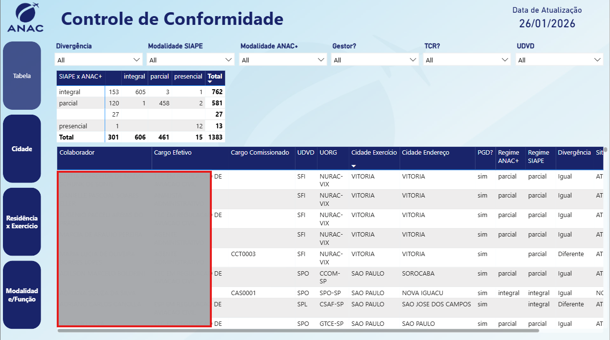
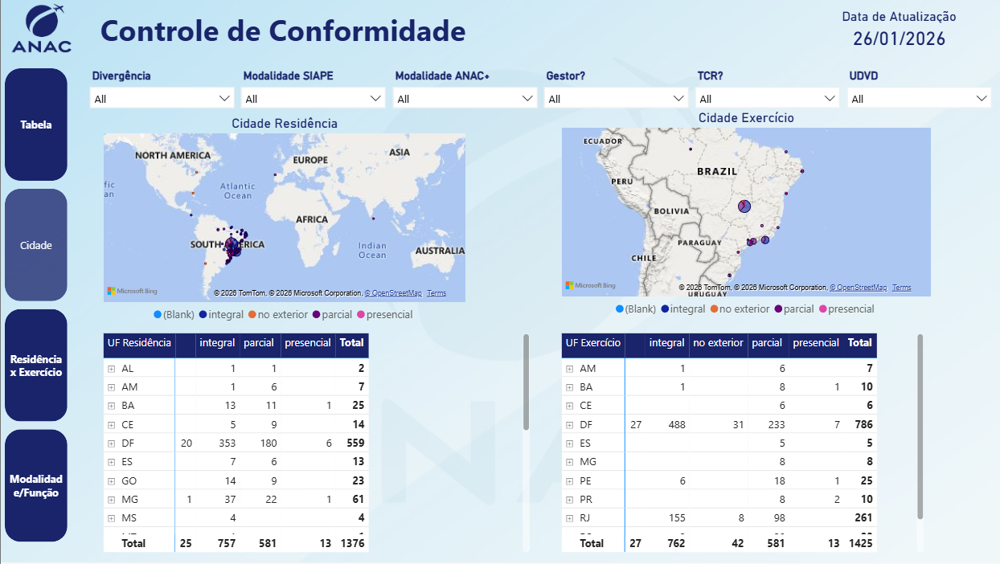
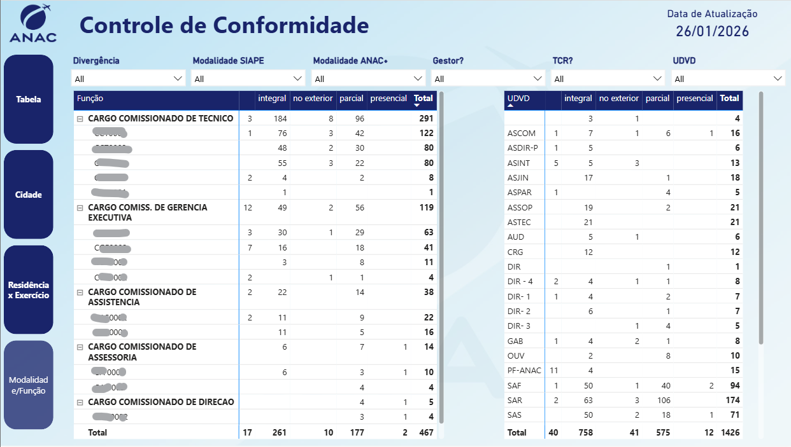

# Projeto — Controle de Regime de Trabalho (ANAC)

## Visão Geral
Projeto desenvolvido para **padronização, validação e análise do regime de trabalho dos servidores**, integrando informações provenientes de **dois sistemas distintos: ANAC+ e SIAPE**.

A solução foi criada para identificar inconsistências cadastrais, garantir respostas padronizadas e fornecer uma **visão confiável sobre a distribuição dos servidores em regime presencial, remoto (online) e parcial**, apoiando decisões estratégicas da área de gestão de pessoas.

---

## Objetivos do Projeto
- Garantir que os servidores possuam **regimes de trabalho padronizados e consistentes** entre sistemas distintos.
- Identificar divergências de preenchimento entre ANAC+ e SIAPE.
- Facilitar o acompanhamento da **quantidade de servidores presenciais, remotos e híbridos**.
- Apoiar decisões relacionadas a **alocação de pessoas, políticas de trabalho e governança de dados**.

---

## Escopo Técnico
- Extração e consolidação de dados a partir de **múltiplas fontes/sistemas**.
- Padronização de valores categóricos (regime integral, presencial e parcial).
- Modelagem de dados voltada à análise comparativa entre sistemas.
- Desenvolvimento de **dashboard interativo em Power BI**, com múltiplas visões analíticas.

---

## Estrutura do Dashboard

### Aba — Tabela de Servidores
- Lista consolidada dos servidores/colaboradores.
- Comparação direta do regime de trabalho informado em cada sistema.
- Identificação de inconsistências e divergências cadastrais.
  

### Aba — Cidade (Residência x Exercício)
- Comparação entre **cidade de residência** e **cidade de exercício**.
- Análise do impacto geográfico nos regimes de trabalho.
- Suporte a decisões sobre presencialidade e distribuição territorial.

### Aba — Função e Modalidade
- Análise por **cargo/função**.
- Distribuição dos servidores por **modalidade de trabalho** (presencial, remoto, parcial).
- Apoio à avaliação de políticas de trabalho por área ou função.

---

## Tecnologias Utilizadas
- Power BI
- Power Plataform
- Microsoft Fabric
- SQL (extração e tratamento de dados)
- Modelagem de Dados
- Padronização e Governança da Informação

---

## Governança e Qualidade dos Dados
O projeto foi desenvolvido com foco em:
- Consistência entre sistemas corporativos
- Padronização de respostas categóricas
- Confiabilidade das informações analíticas
- Redução de erros manuais e retrabalho

---

## Alinhamento com Power Platform e Automação
Este projeto reflete cenários comuns em ambientes corporativos de **Power Platform e Microsoft Fabric**, especialmente:
- Integração de múltiplas fontes de dados
- Padronização e transformação de dados (ETL)
- Governança da informação
- Suporte à automação de processos e decisões estratégicas

---

## Observação
Os dados apresentados neste repositório são **anonimizados ou simulados**, preservando a confidencialidade institucional.
